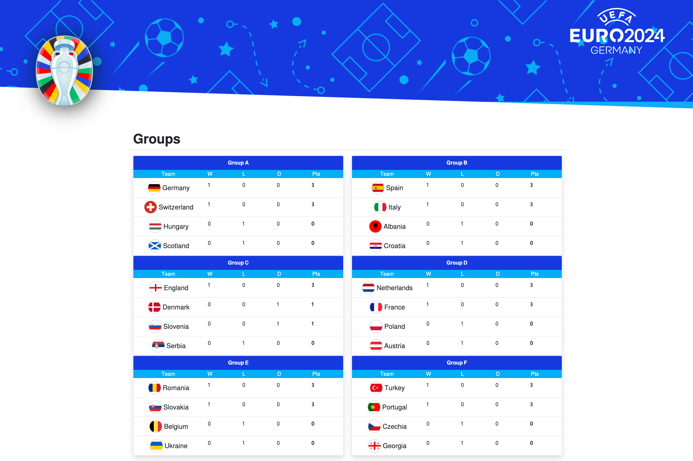

# Live Scoreboard 



All Euro '24 live scores, final results, fixtures and standings! This flask application fetches real-time football data using an API. 
This project is perfect for those who want to learn how to use simple Flask code to create a dynamic webpage with data fetched from an external API.

- Get your Football Data API key from [football-data.org](https://www.football-data.org/documentation/quickstart).

1. **Clone the Repository:**
```
git clone https://github.com/pypyguru/Euro-Cup-2024-Live-Scoreboard.git
```

2. **Set Up API Key:**
Open `config.py` and replace `'YOUR_API_KEY'` with your actual API key from [football-data.org](http://football-data.org/)
```
API_KEY = 'YOUR_API_KEY'
```

If you have any questions or feedback, feel free to open an issue in the repository. Enjoy the matches!
